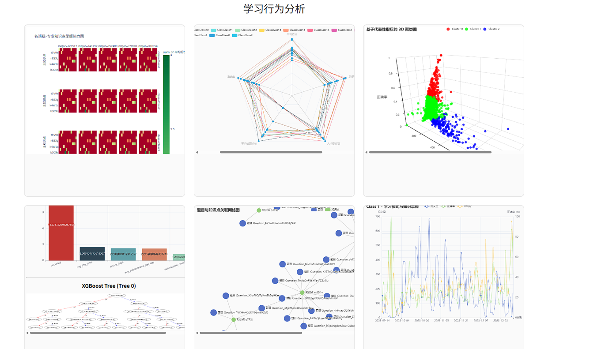

学生行为大数据分析与可视化平台 (Student Behavior Analytics Platform)
这是一个端到端的全栈数据分析系统，旨在处理教育大数据，深入分析学生的学习行为，并提供可交互的可视化洞察。本项目集成了数据工程、机器学习（XGBoost, K-Means）以及全栈开发（Flask, Dash, Vue.js）技术，为教育者提供可落地的辅助决策支持。

## 📖 项目简介
该平台通过处理原始的学生提交记录和元数据，构建了一个综合性的可视化仪表盘。系统主要功能包括：

知识点掌握度分析：可视化展示不同班级和专业在具体知识点上的得分热力图。

班级能力画像：通过多维雷达图对比各班级在“平均分、准确率、提交频次”等维度的表现。

学生群体聚类：利用 K-Means 算法对学生行为进行 3D 聚类，识别不同类型的学习群体。

成绩预测与归因：基于 XGBoost 模型预测学生成绩，并量化关键特征（如活跃天数、提交时间）的影响力。

知识图谱构建：生成题目与知识点的关联网络图，揭示知识结构。

时序行为分析：交互式时间轴展示全班级的提交活跃度趋势。

## 🛠 技术栈
后端与Web框架: Python, Flask, Dash

数据处理: Pandas, NumPy

机器学习: Scikit-learn, XGBoost

数据可视化: Pyecharts, Plotly, ECharts

前端集成: Vue.js (静态资源集成)

## 🌟 核心功能
知识点热力图 (Knowledge Heatmap) 利用分面热力图展示各班级、各专业在细分知识点上的平均得分情况，快速定位教学薄弱环节。

班级能力雷达 (Class Radar Analysis) 基于归一化后的五个核心指标（平均分、准确率、答题时长、人均提交数、总提交数）评估班级综合能力。

3D 行为聚类 (3D Behavioral Clustering) 应用无监督学习（K-Means），根据提交次数、平均分和准确率将学生划分为不同群体，并在 3D 空间中可视化。

XGBoost 归因分析 (XGBoost Attribution) 训练梯度提升树模型预测学习成果，并可视化特征重要性（Feature Importance）和决策树结构。

知识关联图谱 (Knowledge Graph) 构建题目与知识点之间的网络拓扑图，直观展示题库的知识点覆盖分布。

时间线 (Timeline Analysis) 带有时间轴播放功能的动态柱状图，展示各班级随时间变化的提交活跃度。

```text
Student-Behavior-Visualization/
│
├── app.py                  # [后端入口] Flask 主程序，负责启动服务和调度分析任务
├── requirement.txt         # [环境依赖] Python 项目依赖库列表
│
├── data/                   # [数据源] 存放原始 CSV 数据文件
│   ├── Data_StudentInfo.csv       # 学生基础信息
│   ├── Data_TitleInfo.csv         # 题目与知识点信息
│   └── SubmitRecord-Class*.csv    # 各班级的学生提交记录
│
├── ml/                     # [核心算法] 数据分析与机器学习脚本模块
│   ├── Dataquality.py      # 数据质量检测与清洗
│   ├── Xgboost.py          # 成绩预测模型与特征重要性分析
│   ├── _3d_scatter.py      # K-Means 学生行为 3D 聚类
│   ├── knowledge_heatmap.py# 知识点掌握度热力图生成
│   ├── network.py          # 题目-知识点关联网络图构建
│   ├── radar_chart.py      # 班级能力多维雷达图
│   └── timeline.py         # 班级提交活跃度时序分析
│
├── result/                 # [输出结果] 脚本运行后生成的 HTML 可视化图表
│   ├── knowledge_heatmap.html
│   ├── xgb_model_visualization.html
│   └── ...
│
├── frontend/               # [前端工程] Vue.js 前端项目源码
│   ├── package.json        # 前端依赖配置
│   ├── src/                # Vue 组件源代码
│   │   ├── views/          # 页面视图 (如 TheDashboard.vue)
│   │   └── ...
│   └── public/             # 静态资源
│
└── images/                 # 项目演示截图
```

## 🚀 安装与运行
### 1. 克隆仓库
下载本项目到本地环境。

### 2. 环境准备
 确保您的环境已安装 Python 3.8+。建议使用虚拟环境。

安装项目依赖：

Bash

pip install -r requirements.txt
注意：如果根目录下没有 requirements.txt，请手动安装核心库：

Bash

pip install pandas flask dash xgboost pyecharts scikit-learn plotly
### 3. 数据准备
请确保 data/ 目录下包含以下格式的原始数据文件：

Data_StudentInfo.csv

Data_TitleInfo.csv

SubmitRecord-Class*.csv (各班级提交记录)

### 4. 启动应用
运行主程序，系统将自动进行数据清洗、模型训练、生成图表并启动 Web 服务器。

Bash

python app.py
程序启动后，会自动在 result/ 目录下生成所有 HTML 可视化文件。


## 📊 系统截图


可视化大屏主页: 

